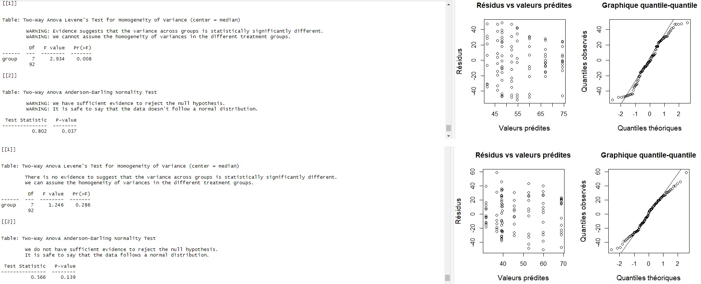
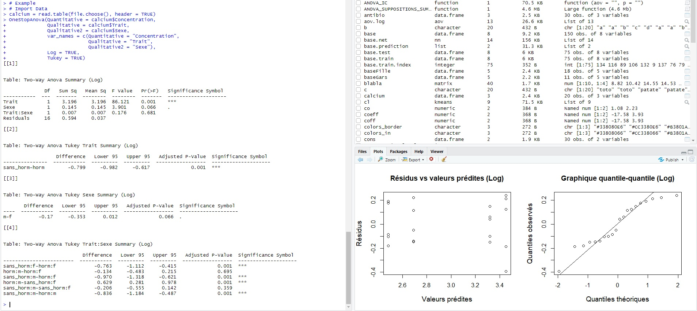
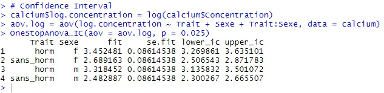

# SCI1018 One-Way Anova | Two-Way Anova

**OneStopAnova** est un package réalisé dans le cadre du cours **SCI1018 - Statistiques avec R** de la TÉLUQ pour les cours traitant d'Anova. 

L'objectif de ce package est de réduire substantiellement le nombre d'étapes de codification pour les futur(e)s étudiant(e)s.

En date d'août 2020, le package offre deux fonctions, soit: **OneStopAnova()** et **OneStopAnova_IC()**. 

# Brève description des opérations effectuées par le package

**OneStopAnova():**

  - Vérification des suppositions d'homoscédasticité et de normalité des résidus:
  
    - Supposition d'homoscédasticité:
    
        - Test de Levene pour l'homogénéité de la variance avec une explication textuelle vous signifiant si les conditions sont respectées.
        
        - Graphique résidus vs valeurs prédites.
        
    - Supposition de normalité des résidus:
    
        - Test de normalité d'Anderson-Darling avec une explication textuelle vous signifiant si les conditions sont respectées. 
        
        - Graphique quantile-quantile.
        
        
  - Création d'un tableau sommaire des résultats du test Anova.
  
  - (OPTIONNEL) Création d'un tableau sommaire pour le test de Tukey:
        
       - Par défaut, cet argument est FALSE. En sélectionnant TRUE, vous effectuerez un test de Tukey sur les variables sélectionnées.
      
  
  - (OPTIONNEL) Transformation logarithmique de la variable quantitative:
  
       - Par défaut, cet argument est FALSE. En sélectionnant TRUE, vous effectuerez une transformation logarithmique de la variable quantitative.
  
**OneStopAnova_IC():**

  - Fonction permettant d'obtenir directement l'intervalle de confiance.

# Installation du package OneStopAnova

Pour installer ce package, vous devrez d'abord installer le package devtools:
```
install.packages("devtools")
  
library(devtools)
```

Par la suite, vous serez en mesure d'importer le package à partir de GitHub:
```
install_github("AlexandreMillette1989/OneStopAnova", force = TRUE, dependencies = TRUE, upgrade = FALSE)
  
library(OneStopAnova)
```
  
**Si vous rencontrez une erreur lors de l'installation ou de la mise à jour d'une des dépendences, vous pouvez effectuer le code suivant:**
```
packages = c("knitr", "dplyr", "car", "nortest")
             
package.check <- lapply(
  packages,
  FUN = function(x) {
  if (!require(x, character.only = TRUE)) {
  install.packages(x, dependencies = TRUE)
  library(x, character.only = TRUE)
  }
 }
)
```
# Exemple 7.1 (Module 7) pages 7 à 24
```
calcium = read.table(file.choose(), header = TRUE)
```
**Two-Way Anova | Log | Tukey**

**OneStopAnova()**

- Quantative = nom de la variable quantitative;

- Qualitative = nom de la variable qualitative;

- Qualitative2 = nom de la deuxième variable qualitative (Two-Way Anova);

- var_names = le nom que vous souhaitez donner à vos variables;

- Log (optionnel) = FALSE par défaut. Si l'argument est TRUE, la fonction effectue une transformation logarithmique de la variable quantitative. 

- Tukey (optionnel) = FALSE par défaut. Si l'argument est TRUE, la fonction effectue un test de Tukey sur les variables sélectionnées. 

```
OneStopAnova(Quantitative = calcium$Concentration,
             Qualitative = calcium$Trait,
             Qualitative2 = calcium$Sexe,
             var_names = c(Quantitative = "Concentration",
                           Qualitative = "Trait",
                           Qualitative2 = "Sexe"),
             Log = TRUE,
             Tukey = TRUE)
```
**Cliquez sur les images pour agrandir**

Le *Graphique 1* présente un exemple fictif de vérification des suppositions. 

Lorsque les tests présentent des résultats P <= 0.05, un message contenant la mention **Warning** apparaît pour signaler un problème au niveau des suppositions.

Lorsque les test présentent des résultats P > 0.05, un message sans avertissement apparaît pour signaler que vous respectez les suppositions.

**Graphique 1**


Le *Graphique 2* présente un sommaire du test Anova (Log) ainsi que les résultats du test de Tukey.

**Graphique 2**


**OneStopAnova_IC()**
```
calcium$log.concentration = log(calcium$Concentration)
aov.log = aov(log.concentration ~ Trait + Sexe + Trait:Sexe, data = calcium)
OneStopAnova_IC(aov = aov.log, p = 0.025)
```
**Cliquez sur l'image pour agrandir**

Le *Graphique 3* renvoie à un data frame présentant la moyenne (fit) et l'intervalle de confiance.

Vous pouvez donc créer un objet à partir de cette fonction pour effectuer votre graphique d'intervalle de confiance subséquemment. 



**Pour obtenir de l'aide quant aux arguments de la fonction, vous pouvez faire:**
```
?OneStopAnova

?OneStopAnova_IC
```

**Pour obtenir de l'aide quant à l'utilisation du package ou concernant les erreurs, vous pouvez envoyez un courriel à: alexandre.millette1989@gmail.com**
